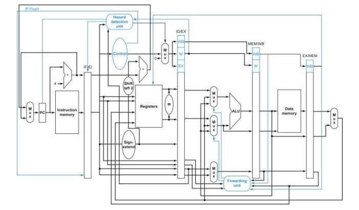

# Phase 2

## WISC-S24 ISA
| **Instruction** | **Opcode** |
| ----------- | ------ |
| ADD | 0000 |
| SUB | 0001 |
| XOR | 0010 |
| RED | 0011 |
| SLL | 0100 |
| SRA | 0101 |
| ROR | 0110 |
| PADDSUB | 0111 |
| LW | 1000 |
| SW | 1001 |
| LLB | 1010 |
| LHB | 1011 |
| B | 1100 |
| BR | 1101 |
| PCS | 1110 |
| HLT | 1111 |

## Memory System
1) **Single-cycle Instruction Memory**

    1.1) 16-bit address input

    1.2) 16-bit data output
   
2) **Data Memory**

    2.1) 16-bit address input, 16-bit data input

    2.2) 16-bit data output

    2.3) Write enable

## Implementation
1) **Pipelined Design**

    1.1) Five-stage pipeline: **IF, ID, EX, MEM, WB**

    1.2) Implement hazard detection

    1.3) Implement register bypassing:

        --> EX-to-EX forwarding

        --> MEM-to-EX forwarding

        --> MEM-to-MEM forwarding

    1.4) Implement predict-not-taken for branch instructions (flushes instructions when branch is taken)

>[!Note]
>Branches should be resolved in the ID stage
   
2) **Stall/Flush**

    2.1) A stall is performed by using a global stall signal, which disables the write-enable signals to the D-FFs of the upstream pipeline registers (i.e., upstream from the stalling stage).

    2.2) Flushes can be performed by converting the flushed operations into NOPs (i.e., preventing them from performing register/memory writes and from making changes to any other processor state, such as flags).
   
3) **HLT Instruction**

    3.1) The HLT instruction should raise the ‘hlt’ signal only when it reaches the **WB** stage. In the **IF** stage, you need to check for HLT instructions.

    3.2) If you fetch a HLT instruction, you must prevent the PC from being updated.

>[!Note]
>The only exception is when the HLT instruction is fetched immediately after a taken branch
   
4) **Schematic**

>[!Note]
>Stages **MEM/WB** and **EX/MEM** are swapped
   
5) **Reset Sequence**

WISC-S24 has an active low reset input (rst_n). Instructions are executed when rst_n is high. If rst_n goes low for one clock cycle, the contents of the state of the machine is reset and starts execution at address 0x0000.

## Interface
Your top level Verilog code should be in file named ***cpu.v***. It should have a simple 4-signal interface: ***clk***, ***rst_n***, ***hlt*** and ***pc[15:0]***.

| **Signal** | **Direction** | **Description** |
| ---------- | ------------- | --------------- |
| clk | in | System clock |
| rst_n | in | Active low reset |
| hlt | out | When your processor encounters the HLT instruction, it will assert this signal once it has finished processing the last instruction before the HLT |
| pc[15:0] | out | PC value over the course of the program execution |

